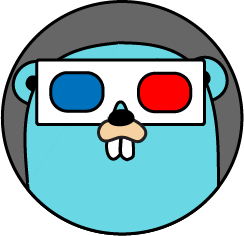
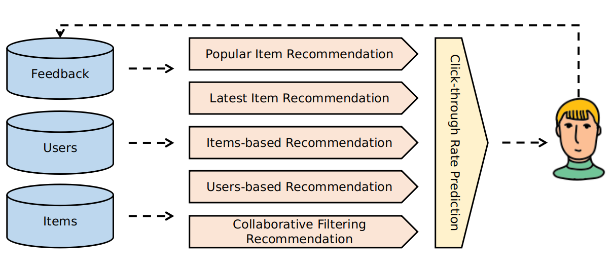
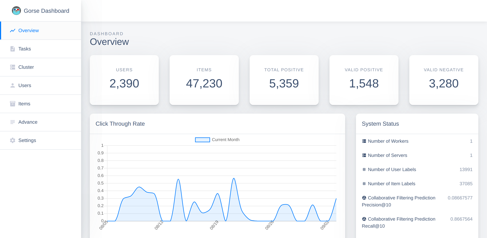
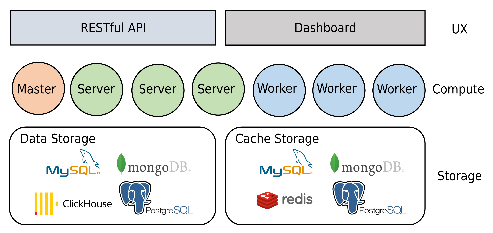

# gorse: Go Recommender System Engine

Gorse is an open-source recommendation system written in Go. Gorse aims to be an universal open-source recommender system that can be quickly introduced into a wide variety of online services. By importing items, users and interaction data into Gorse, the system will automatically train models to generate recommendations for each user. Project features are as follows.

- **Multi-source Recommendation:** For a user, recommended items are collected from different ways (popular, latest, user-based, item-based and collaborative filtering) and ranked by click-through rate prediction.
- **AutoML**: Choose the best recommendation model and strategy automatically by model searching in the background.
- **Distributed Recommendation**: Single node training, distributed prediction, and ability to achieve horizontal scaling in the recommendation stage.
- **RESTful API**: Provide RESTful APIs for data CRUD and recommendation requests.
- **Dashboard**: Provide dashboard for data import and export, monitoring, and cluster status checking.

## Quick Start

- [Run Gorse manually](https://github.com/zhenghaoz/gorse/tree/master/cmd)
- [Run Gorse with Docker Compose](https://github.com/zhenghaoz/gorse/tree/master/docker)
- [Use Gorse to recommend awesome GitHub repositories](https://github.com/zhenghaoz/gitrec)
- [Read official documents](https://docs.gorse.io/)
- [Read develop roadmap](https://github.com/zhenghaoz/gorse/projects)

## Architecture

Gorse is a single node training and distributed prediction recommender system. Gorse stores data in MySQL, MongoDB, PostgresSQL or ClickHouse, with intermediate data cached in Redis. 

1. The cluster consists of a master node, multiple worker nodes, and server nodes.
1. The master node is responsible for model training, non-personalized item recommendation, configuration management, and membership management.
1. The server node is responsible for exposing the RESTful APIs and online real-time recommendations.
1. Worker nodes are responsible for offline recommendations for each user. 

In addition, the administrator can perform system monitoring, data import and export, and system status checking via the dashboard on the master node.

## Contributors

Any contribution is expected: report a bug, give advice or even create a pull request. Welcome to submit [*Gorse In-Production User Registration*](https://forms.office.com/r/q04Fgkh18t) to add your product to the case studies section of [gorse.io](https://gorse.io/) if Gorse has been used in production.

## Acknowledgments

`gorse` is inspired by the following projects:

- [Guibing Guo's librec](https://github.com/guoguibing/librec)
- [Nicolas Hug's Surprise](https://github.com/NicolasHug/Surprise)
- [Golang Samples's gopher-vector](https://github.com/golang-samples/gopher-vector)
