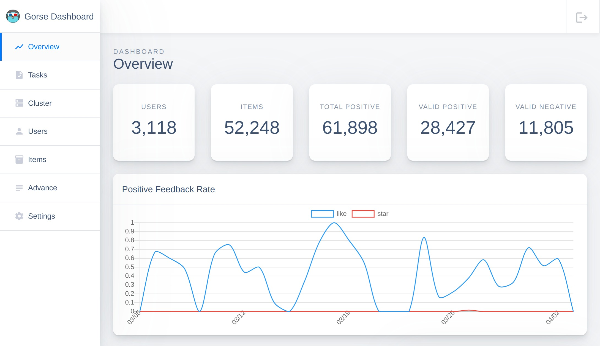

# Gorse Recommender System Engine


[](https://github.com/gorse-io/gorse/actions/workflows/build_test.yml)
[](https://codecov.io/gh/gorse-io/gorse)
[](https://goreportcard.com/report/github.com/gorse-io/gorse)
[](https://discord.gg/x6gAtNNkAE)
[](https://twitter.com/gorse_io)
[](https://gurubase.io/g/gorse)

Gorse is an open-source recommendation system written in Go. Gorse aims to be a universal open-source recommender system that can be quickly introduced into a wide variety of online services. By importing items, users, and interaction data into Gorse, the system will automatically train models to generate recommendations for each user. Project features are as follows.


- **Multi-source:** Recommend items from Popular, latest, user-based, item-based and collaborative filtering.
- **AutoML:** Search the best recommendation model automatically in the background.
- **Distributed prediction:** Support horizontal scaling in the recommendation stage after single node training.
- **RESTful APIs:** Expose RESTful APIs for data CRUD and recommendation requests.
- **Online evaluation:** Analyze online recommendation performance from recently inserted feedback.
- **Dashboard:** Provide GUI for data management, system monitoring, and cluster status checking.

## Quick Start

The playground mode has been prepared for beginners. Just set up a recommender system for GitHub repositories by the following commands.

- Linux/macOS:

```bash
curl -fsSL https://gorse.io/playground | bash
```

- Docker:

```bash
docker run -p 8088:8088 zhenghaoz/gorse-in-one --playground
```

The playground mode will download data from [GitRec](https://gitrec.gorse.io/) and import it into Gorse. The dashboard is available at `http://localhost:8088`.



After the "Find neighbors of items" task is completed on the "Tasks" page, try to insert several feedbacks into Gorse. Suppose Bob is a frontend developer who starred several frontend repositories in GitHub. We insert his star feedback to Gorse.

```bash
read -d '' JSON << EOF
[
    { \"FeedbackType\": \"star\", \"UserId\": \"bob\", \"ItemId\": \"vuejs:vue\", \"Timestamp\": \"2022-02-24\" },
    { \"FeedbackType\": \"star\", \"UserId\": \"bob\", \"ItemId\": \"d3:d3\", \"Timestamp\": \"2022-02-25\" },
    { \"FeedbackType\": \"star\", \"UserId\": \"bob\", \"ItemId\": \"dogfalo:materialize\", \"Timestamp\": \"2022-02-26\" },
    { \"FeedbackType\": \"star\", \"UserId\": \"bob\", \"ItemId\": \"mozilla:pdf.js\", \"Timestamp\": \"2022-02-27\" },
    { \"FeedbackType\": \"star\", \"UserId\": \"bob\", \"ItemId\": \"moment:moment\", \"Timestamp\": \"2022-02-28\" }
]
EOF

curl -X POST http://127.0.0.1:8088/api/feedback \
   -H 'Content-Type: application/json' \
   -d "$JSON"
```

Then, fetch 10 recommended items from Gorse. We can find that frontend-related repositories are recommended for Bob.

```bash
curl http://127.0.0.1:8088/api/recommend/bob?n=10
```

<details>
<summary>Example outputs:</summary>

```json
[
 "mbostock:d3",
 "nt1m:material-framework",
 "mdbootstrap:vue-bootstrap-with-material-design",
 "justice47:f2-vue",
 "10clouds:cyclejs-cookie",
 "academicpages:academicpages.github.io",
 "accenture:alexia",
 "addyosmani:tmi",
 "1wheel:d3-starterkit",
 "acdlite:redux-promise"
]
```

</details>

> The exact output might be different from the example since the playground dataset changes over time.

For more information：

- Read [official documents](https://gorse.io/docs/master)
- Visit [official demo](https://gitrec.gorse.io/)
- Discuss on [Discord](https://discord.gg/x6gAtNNkAE) or [GitHub Discussion](https://github.com/gorse-io/gorse/discussions)

## Architecture

Gorse is a single-node training and distributed prediction recommender system. Gorse stores data in MySQL, MongoDB, Postgres, or ClickHouse, with intermediate results cached in Redis, MySQL, MongoDB and Postgres.

1. The cluster consists of a master node, multiple worker nodes, and server nodes.
1. The master node is responsible for model training, non-personalized item recommendation, configuration management, and membership management.
1. The server node is responsible for exposing the RESTful APIs and online real-time recommendations.
1. Worker nodes are responsible for offline recommendations for each user.

In addition, the administrator can perform system monitoring, data import and export, and system status checking via the dashboard on the master node.


## Contributors

<a href="https://github.com/gorse-io/gorse/graphs/contributors">
  
</a>

Any contribution is appreciated: report a bug, give advice or create a pull request. Read [CONTRIBUTING.md](CONTRIBUTING.md) for more information.

## Acknowledgments

`gorse` is inspired by the following projects:

- [Guibing Guo's librec](https://github.com/guoguibing/librec)
- [Nicolas Hug's Surprise](https://github.com/NicolasHug/Surprise)
- [Golang Samples's gopher-vector](https://github.com/golang-samples/gopher-vector)
